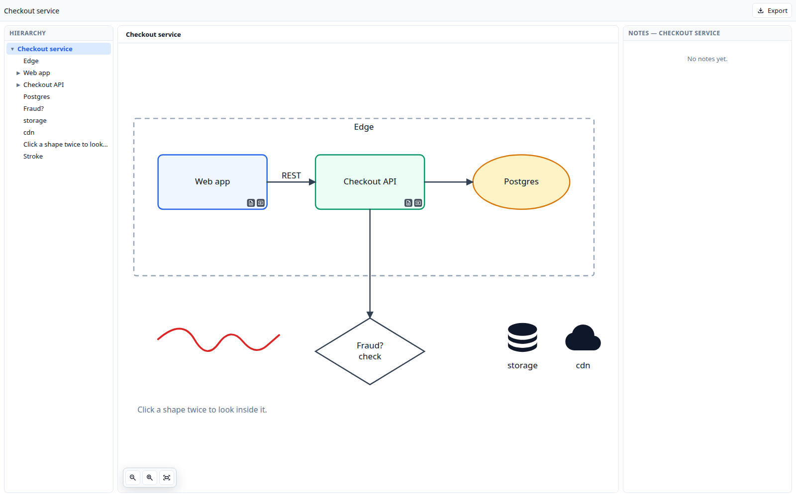

# deepdraw-skill

An agent skill for [**DeepDraw**](https://deepdraw.ai) — drawings where any
shape can contain a whole nested drawing and its own markdown notes.

The skill lets an agent author a diagram as JSON and build the **standalone
HTML file DeepDraw exports and imports**: one self-contained file with the
library and the document inlined. Open it in any browser, or bring it into
deepdraw.ai through **☰ → Import…**.



## Install

Claude Code, for one project or for every project:

```bash
git clone https://github.com/philter87/deepdraw-skill
cp -r deepdraw-skill/deepdraw ~/.claude/skills/     # or .claude/skills/ in a project
```

Then ask for a drawing — "map this service out in DeepDraw", "draw the deploy
pipeline as a DeepDraw file" — and the agent writes a spec, builds it, and hands
back the `.html`.

The scripts are plain Python 3 with no dependencies, so they are usable on their
own from any agent or shell.

## What is in it

```
deepdraw/
  SKILL.md                        how the agent works: plan, spec, build
  reference/
    spec.md                       the authoring grammar — fields, types, defaults
    document-format.md            DeepDraw's own document JSON and its three export formats
    layout.md                     canvas sizing, coordinates, arrows, nesting, colour
    icons.md                      Iconify search, and how an icon lives in a node
    template.html                 the export template: DeepDraw inlined, two placeholders
  scripts/
    build_html.py                 spec → validated document → standalone HTML
    deepdraw_doc.py               the model: defaults, arrow geometry, validation
    iconify.py                    search and fetch icons from api.iconify.design
  examples/
    checkout-service.json         a three-level spec using most of the model
```

## Try it

```bash
cd deepdraw
python3 scripts/build_html.py examples/checkout-service.json -o /tmp/checkout.html
xdg-open /tmp/checkout.html
```

## The format

The whole hierarchy — every nested drawing — is one JSON document: a flat
`nodes` map, a tree through `parentId`, and a node's children *are* its nested
drawing. The HTML export puts that document in a
`<script id="dd-document" type="application/json">` next to the inlined library,
which is what makes one file both a working page and something DeepDraw can read
back. `reference/document-format.md` has the details.

`reference/template.html` is generated from DeepDraw's own `toStandaloneHtml`,
so the files this skill writes are the files DeepDraw writes.

## Licence

MIT. DeepDraw itself is a separate project; the bundled library in
`reference/template.html` belongs to it.
