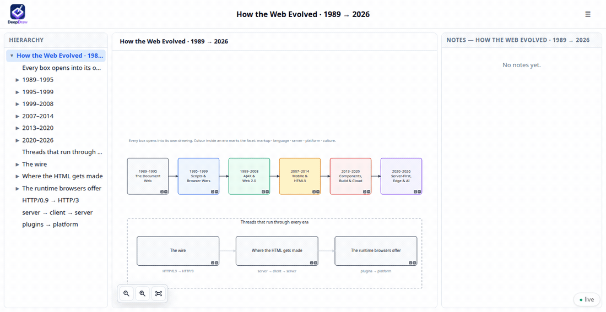

# deepdraw-skill

An agent skill for [**DeepDraw**](https://deepdraw.ai) — drawings where any
shape can contain a whole nested drawing and its own markdown notes.

Ask for a diagram and the agent generates **an interactive HTML file**: one
self-contained page you can open in any browser, click through, and import
straight into deepdraw.ai.



## Install

The skill is the `skills/deepdraw/` directory. Every agent below reads the same
`SKILL.md`; they only disagree about where to put it.

### Claude Code

One command, from inside Claude Code:

```
/plugin marketplace add philter87/deepdraw-skill
/plugin install deepdraw@deepdraw-skill
```

Or copy it in by hand — `~/.claude/skills/` for every project, `.claude/skills/`
for one:

```bash
git clone https://github.com/philter87/deepdraw-skill
mkdir -p ~/.claude/skills && cp -r deepdraw-skill/skills/deepdraw ~/.claude/skills/
```

### GitHub Copilot

```bash
git clone https://github.com/philter87/deepdraw-skill
mkdir -p ~/.copilot/skills && cp -r deepdraw-skill/skills/deepdraw ~/.copilot/skills/
```

Per repository instead: `.github/skills/deepdraw/`.

### Codex

```bash
git clone https://github.com/philter87/deepdraw-skill
mkdir -p ~/.agents/skills && cp -r deepdraw-skill/skills/deepdraw ~/.agents/skills/
```

Per repository instead: `.agents/skills/deepdraw/`.

`~/.agents/skills/` is read by Copilot as well, so one copy there covers both.

## Use

Ask in plain language — *"map this service out in DeepDraw"*, *"draw the deploy
pipeline"* — or invoke it directly: `/deepdraw` in Claude Code, `$deepdraw` in
Codex. The agent plans the hierarchy, writes a spec, builds it, and hands back
the `.html`.

Nothing to install beyond Python 3: the scripts have no dependencies.

## Licence

MIT. DeepDraw itself is a separate project; the library bundled inside
`skills/deepdraw/reference/template.html` belongs to it.
